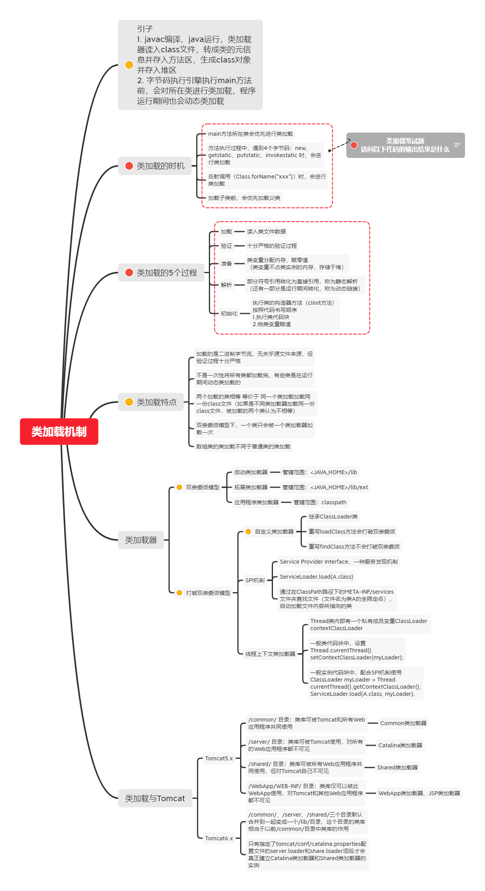
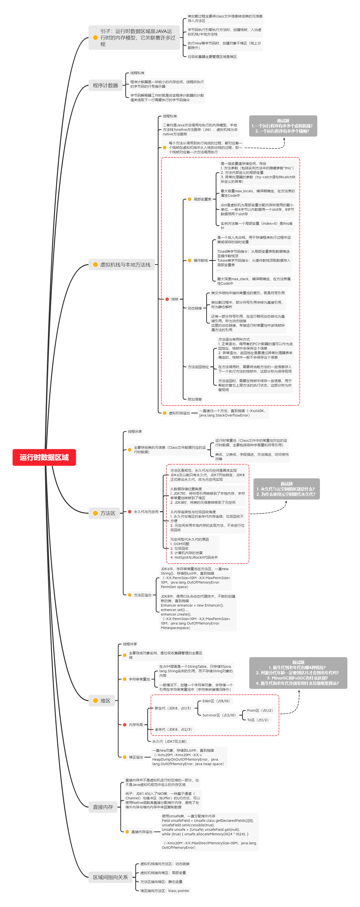

- [前言](#前言)
- [JAVA虚拟机的定义](#java虚拟机的定义)
- [JAVA语言的水深](#java语言的水深)
- [如何学习JVM](#如何学习jvm)
- [项目成果](#项目成果)
- [文章目录](#文章目录)
  - [第0章：jvm基础概念](#第0章jvm基础概念)
  - [第1章：类加载机制与类加载器](#第1章类加载机制与类加载器)
  - [第2章：类文件结构与字节码指令](#第2章类文件结构与字节码指令)
  - [第3章：运行时数据区域](#第3章运行时数据区域)
  - [第4章：字节码执行引擎](#第4章字节码执行引擎)
  - [第5章：对象的生命周期](#第5章对象的生命周期)
  - [第6章：垃圾收集机制](#第6章垃圾收集机制)
  - [第7章：JVM性能调优](#第7章jvm性能调优)
  - [第8章：JVM总结](#第8章jvm总结)
- [思维导图](#思维导图)
  - [类加载机制](#类加载机制)
  - [运行时数据区域](#运行时数据区域)
  - [垃圾收集机制](#垃圾收集机制)

# 深入理解JAVA虚拟机-第一至三层

### 前言

我希望写多篇文章，组合成一份文章集，包含关于JAVA虚拟机的入门原理、常见问题、代码例子证明等

读者阅读它，能像读小说一样，从第一篇文章，读到最后一篇文章，尽量把讳莫如深难懂的内容写得简单易懂，当然这也需要读者具有一定的JAVA功底

引用《深入理解JAVA虚拟机》第二版6.3节的话：力求在保证逻辑准确的前提下，用尽量通俗的语言和案例去讲述虚拟机中与开发关系最为密切的内容

**声明**

转载请注明出处：https://github.com/peteryuanpan/notebook/blob/master/深入理解JAVA虚拟机-第一至三层

本文部分内容来自鲁班学院的课程，感谢老师们以及同学们对我的帮助，特别感谢一下子牙老师

还有部分内容来自《深入理解JAVA虚拟机》第二版以及第三版，第二版是基于JDK7的，第三版是基于JDK8及以后的，本文内容是基于JDK8的（Hotspot实现），我会去对比第二版与第三版的差异点，并记录在文中

### JAVA虚拟机的定义

JAVA虚拟机是一种能够运行JAVA字节码程序的虚拟机器

> A Java virtual machine (JVM) is a virtual machine that enables a computer to run Java programs as well as programs written in other languages that are also compiled to Java bytecode. From https://en.wikipedia.org/wiki/Java_virtual_machine.

虚拟机是一个相对于物理机的概念，这两种机器都有代码执行能力，其区别是物理机的执行引擎是直接建立在处理器、缓存、指令集和操作系统层面上的，而虚拟机的执行引擎则是由软件自行实现的，因此可以不受物理条件制约地定制指令集与执行引擎的结构体系，能够执行那些不被硬件直接支持的指令集格式

### JAVA语言的水深

JAVA这潭大湖，从上往下，一共有7层（人为定义的）

- JAVA语法
- JAVA字节码
- JVM原理
- JVM源码
- 操作系统层
- 汇编码层
- CPU层

笔者的能力是有限的，望读者见谅，这篇文章集能接触到的水深，只有第 1-3 层 + 第4层表面，第4层JVM源码往下，不会深入包含，且本篇文章集只在单线程的情况下总结JVM的原理，不涉及多线程

并发的概念需要涉及到操作系统原理、CPU原理，将在[深入理解JAVA并发与集合](../深入理解JAVA并发与集合)文章集中总结

### 如何学习JVM

两个方向：内存模型、字节码

学习方法
- 学习了一块知识点后，自己梳理成文章总结（这是第一步，更优先）
- 然后画思维导图，将内容讲出来，一遍一遍地过，直到能让人听明白为止（这是第二步，十分重要）
- 注意，写出来和说出来对于理解的提高是非常不一样的，写完后必须说出来，讲明白了，就通透了

### 项目成果

类文件结构解析：https://github.com/peteryuanpan/ParseClassFile

### 文章目录

#### 第0章：JVM基础概念
- [JVM基础概念](JVM基础概念.md)
  - [JAVA运行时环境逻辑图](JVM基础概念.md#JAVA运行时环境逻辑图)
  - [oop-klass模型](JVM基础概念.md#oop-klass模型)
  - [InstanceKlass](JVM基础概念.md#InstanceKlass)
    - [InstanceMirrorKlass](JVM基础概念.md#InstanceMirrorKlass)
    - [InstanceRefKlass](JVM基础概念.md#InstanceRefKlass)
  - [ArrayKlass](JVM基础概念.md#ArrayKlass)
    - [TypeArrayKlass](JVM基础概念.md#TypeArrayKlass)
    - [ObjArrayKlass](JVM基础概念.md#ObjArrayKlass)
  - [oopDesc](JVM基础概念.md#oopDesc)
    - [instanceOopDesc](JVM基础概念.md#instanceOopDesc)
    - [arrayOopDesc](JVM基础概念.md#arrayOopDesc)
      - [typeArrayOopDesc](JVM基础概念.md#typeArrayOopDesc)
      - [objArrayOopDesc](JVM基础概念.md#objArrayOopDesc)
  - [JVM源码及调试](JVM基础概念.md#JVM源码及调试)

#### 第1章：类加载机制与类加载器
- [类加载机制](类加载机制.md)
  - [类的定义](类加载机制.md#类的定义)
  - [类加载的定义](类加载机制.md#类加载的定义)
  - [类加载的输入和输出结果](类加载机制.md#类加载的输入和输出结果)
  - [类加载的五个过程](类加载机制.md#类加载的五个过程)
    - [加载](类加载机制.md#加载)
    - [验证](类加载机制.md#验证)
    - [准备](类加载机制.md#准备)
    - [解析](类加载机制.md#解析)
    - [初始化](类加载机制.md#初始化)
  - [类加载的时机](类加载机制.md#类加载的时机)
    - [加载mainClass](类加载机制.md#加载mainClass)
    - [new或getstatic或putstatic或invokestatic](类加载机制.md#new或getstatic或putstatic或invokestatic)
    - [优先加载父类](类加载机制.md#优先加载父类)
    - [反射](类加载机制.md#反射)
  - [类加载笔试题统一解法](类加载机制.md#类加载笔试题统一解法)
- [类加载器](类加载器.md)
  - [类加载器的定义](类加载器.md#类加载器的定义)
  - [类加载的唯一性](类加载器.md#类加载的唯一性)
  - [双亲委派模型](类加载器.md#双亲委派模型)
    - [启动类加载器](类加载器.md#启动类加载器)
    - [拓展类加载器](类加载器.md#拓展类加载器)
    - [应用类程序加载器](类加载器.md#应用类程序加载器)
    - [深入理解双亲委派模型源码](类加载器.md#深入理解双亲委派模型源码)
  - [破坏双亲委派模型](类加载器.md#破坏双亲委派模型)
    - [自定义类加载器](类加载器.md#自定义类加载器)
    - [SPI机制与线程上下文类加载器](类加载器.md#SPI机制与线程上下文类加载器)
  - [类加载与Tomcat](类加载器.md#类加载与Tomcat)

#### 第2章：类文件结构与字节码指令
- [类文件结构](类文件结构.md)
  - [类文件的定义](类文件结构.md#类文件的定义)
  - [类文件的数据紧凑性](类文件结构.md#类文件的数据紧凑性)
  - [类文件的结构轮廓](类文件结构.md#类文件的结构轮廓)
  - [无符号数与表](类文件结构.md#无符号数与表)
  - [类文件例子](类文件结构.md#类文件例子)
  - [魔数](类文件结构.md#魔数)
  - [次版本号与主版本号](类文件结构.md#次版本号与主版本号)
  - [常量池](类文件结构.md#常量池)
    - [常量池的定义](类文件结构.md#常量池的定义)
    - [常量池容量计数器](类文件结构.md#常量池容量计数器)
    - [常量池的结构轮廓](类文件结构.md#常量池的结构轮廓)
    - [CONSTANT_Utf8_info](类文件结构.md#CONSTANT_Utf8_info)
    - [CONSTANT_Integer_info](类文件结构.md#CONSTANT_Integer_info)
    - [8种基本数据类型及自动转换关系](类文件结构.md#8种基本数据类型及自动转换关系)
    - [CONSTANT_Float_info](类文件结构.md#CONSTANT_Float_info)
    - [IEEE754二进制浮点数算术标准](类文件结构.md#IEEE754二进制浮点数算术标准)
      - [例子-十进制浮点数转32位二进制浮点数](类文件结构.md#例子-十进制浮点数转32位二进制浮点数)
      - [例子-32位二进制浮点数转十进制浮点数](类文件结构.md#例子-32位二进制浮点数转十进制浮点数)
    - [CONSTANT_Class_info](类文件结构.md#CONSTANT_Class_info)
    - [全部常量池项结构](类文件结构.md#全部常量池项结构)
  - [类访问标志](类文件结构.md#类访问标志)
  - [本类父类接口](类文件结构.md#本类父类接口)
    - [类索引](类文件结构.md#类索引)
    - [父类索引](类文件结构.md#父类索引)
    - [接口计数器](类文件结构.md#接口计数器)
    - [接口索引集合](类文件结构.md#接口索引集合)
  - [字段表](类文件结构.md#字段表)
    - [字段表计数器](类文件结构.md#字段表计数器)
    - [字段表结构](类文件结构.md#字段表结构)
    - [字段表访问标志](类文件结构.md#字段表访问标志)
    - [访问权限修饰符的作用域](类文件结构.md#访问权限修饰符的作用域)
    - [描述符](类文件结构.md#描述符)
  - [方法表](类文件结构.md#方法表)
    - [方法表计数器](类文件结构.md#方法表计数器)
    - [方法表结构](类文件结构.md#方法表结构)
    - [方法表访问标志](类文件结构.md#方法表访问标志)
    - [重写与重载](类文件结构.md#重写与重载)
    - [clinit与init](类文件结构.md#clinit与init)
  - [属性表](类文件结构.md#属性表)
    - [属性表计数器](类文件结构.md#属性表计数器)
    - [属性表通用结构](类文件结构.md#属性表通用结构)
    - [全部属性表项](类文件结构.md#全部属性表项)
    - [Code](类文件结构.md#Code)
    - [Exceptions](类文件结构.md#Exceptions)
    - [try-catch-finally语句逻辑](类文件结构.md#try-catch-finally语句逻辑)
    - [ConstantValue](类文件结构.md#ConstantValue)
    - [InnerClasses](类文件结构.md#InnerClasses)
    - [内部类访问标志](类文件结构.md#内部类访问标志)
- [字节码指令](字节码指令.md)
  - [字节码指令的定义](字节码指令.md#字节码指令的定义)
  - [字节码指令与解释器](字节码指令.md#字节码指令与解释器)
  - [数据类型与操作类型](字节码指令.md#数据类型与操作类型)
  - [字节码指令分类](字节码指令.md#字节码指令分类)
    - [加载和存储指令](字节码指令.md#加载和存储指令)
    - [运算指令](字节码指令.md#运算指令)
    - [类型转换指令](字节码指令.md#类型转换指令)
    - [对象创建与访问指令](字节码指令.md#对象创建与访问指令)
    - [操作数栈管理指令](字节码指令.md#操作数栈管理指令)
    - [控制转移指令](字节码指令.md#控制转移指令)
    - [方法调用和返回指令](字节码指令.md#方法调用和返回指令)
    - [异常处理指令](字节码指令.md#异常处理指令)
    - [同步指令](字节码指令.md#同步指令)
  - [字节码指令表](字节码指令.md#字节码指令表)

#### 第3章：运行时数据区域
- [运行时数据区域](运行时数据区域.md)
  - [运行时数据区域的定义](运行时数据区域.md#运行时数据区域的定义)
  - [程序计数器](运行时数据区域.md#程序计数器)
  - [虚拟机栈与本地方法栈](运行时数据区域.md#虚拟机栈与本地方法栈)
    - [虚拟机栈与本地方法栈的定义](运行时数据区域.md#虚拟机栈与本地方法栈的定义)
    - [栈帧的概念](运行时数据区域.md#栈帧的概念)
    - [虚拟机栈与本地方法栈溢出](运行时数据区域.md#虚拟机栈与本地方法栈溢出)
      - [例子1-单线程调用方法过深导致栈深度溢出](运行时数据区域.md#例子1-单线程调用方法过深导致栈深度溢出)
      - [例子2-过多线程调用方法导致OutOfMemory](运行时数据区域.md#例子2-过多线程调用方法导致OutOfMemory)
  - [方法区](运行时数据区域.md#方法区)
    - [方法区的定义](运行时数据区域.md#方法区的定义)
    - [永久代及元空间](运行时数据区域.md#永久代及元空间)
    - [元空间取代永久代的理由](运行时数据区域.md#元空间取代永久代的理由)
    - [运行时常量池](运行时数据区域.md#运行时常量池)
    - [方法区溢出](运行时数据区域.md#方法区溢出)
      - [例子1-基于JDK6的字符串常量池溢出](运行时数据区域.md#例子1-基于JDK6的字符串常量池溢出)
      - [例子2-使用CGLib让方法区内存溢出](运行时数据区域.md#例子2-使用CGLib让方法区内存溢出)
  - [堆区](运行时数据区域.md#堆区)
    - [堆区的定义](运行时数据区域.md#堆区的定义)
    - [新生代与老年代与永久代](运行时数据区域.md#新生代与老年代与永久代)
    - [Eden区与两个Survivor区](运行时数据区域.md#Eden区与两个Survivor区)
    - [字符串常量池](运行时数据区域.md#字符串常量池)
    - [堆区溢出](运行时数据区域.md#堆区溢出)
      - [例子1-创建过多对象导致堆区溢出](运行时数据区域.md#例子1-创建过多对象导致堆区溢出)
      - [例子2-再看字符串常量池溢出](运行时数据区域.md#例子2-再看字符串常量池溢出)
  - [直接内存](运行时数据区域.md#直接内存)
    - [直接内存的定义](运行时数据区域.md#直接内存的定义)
    - [直接内存与元空间](运行时数据区域.md#直接内存与元空间)
    - [直接内存溢出例子](运行时数据区域.md#直接内存溢出例子)
      - [例子1-使用Unsafe让直接内存溢出](运行时数据区域.md#例子1-使用Unsafe让直接内存溢出)
  - [调优命令](运行时数据区域.md#调优命令)
    - [查看各区域内存大小](运行时数据区域.md#查看各区域内存大小)
    - [修改各区域内存大小](运行时数据区域.md#修改各区域内存大小)
  - [区域间的指向关系含义](运行时数据区域.md#区域间的指向关系含义)

#### 第4章：字节码执行引擎
- [字节码执行引擎](字节码执行引擎.md)
  - [字节码执行引擎的定义](字节码执行引擎.md#字节码执行引擎的定义)
  - [虚拟机栈与本地方法栈](字节码执行引擎.md#虚拟机栈与本地方法栈)
  - [类加载与方法运行](字节码执行引擎.md#类加载与方法运行)
  - [运行时栈帧结构](字节码执行引擎.md#运行时栈帧结构)
    - [局部变量表](字节码执行引擎.md#局部变量表)
    - [操作数栈](字节码执行引擎.md#操作数栈)
    - [动态链接](字节码执行引擎.md#动态链接)
    - [返回地址](字节码执行引擎.md#返回地址)
  - [方法调用](字节码执行引擎.md#方法调用)
    - [解析调用](字节码执行引擎.md#解析调用)
    - [分派调用](字节码执行引擎.md#分派调用)
      - [静态分派与方法重载](字节码执行引擎.md#静态分派与方法重载)
      - [动态分派与方法重写](字节码执行引擎.md#动态分派与方法重写)
      - [虚方法表与接口方法表](字节码执行引擎.md#虚方法表与接口方法表)
    - [invokedynamic指令](字节码执行引擎.md#invokedynamic指令)
  - [方法执行](字节码执行引擎.md#方法执行)
    - [基于字节码解释器的解释执行](字节码执行引擎.md#基于字节码解释器的解释执行)
    - [基于模板解释器及即时编译器的混合模式](字节码执行引擎.md#基于模板解释器及即时编译器的混合模式)
    - [即时编译技术](字节码执行引擎.md#即时编译技术)
  - [JAVA是半编译半解释型语言](字节码执行引擎.md#JAVA是半编译半解释型语言)

#### 第5章：对象的生命周期
- [对象的生命周期](对象的生命周期.md)
  - [对象的创建过程](对象的生命周期.md#对象的创建过程)
    - [字节码指令new](对象的生命周期.md#字节码指令new)
    - [字节码解释器与new](对象的生命周期.md#字节码解释器与new)
    - [类加载检查](对象的生命周期.md#类加载检查)
    - [内存分配](对象的生命周期.md#内存分配)
      - [指针碰撞](对象的生命周期.md#指针碰撞)
      - [空闲列表](对象的生命周期.md#空闲列表)
      - [TLAB技术](对象的生命周期.md#TLAB技术)
    - [初始化零值](对象的生命周期.md#初始化零值)
    - [设置对象头](对象的生命周期.md#设置对象头)
    - [执行init方法](对象的生命周期.md#执行init方法)
  - [对象的内存布局](对象的生命周期.md#对象的内存布局)
    - [对象头](对象的生命周期.md#对象头)
      - [MarkWord](对象的生命周期.md#MarkWord)
      - [类型指针](对象的生命周期.md#类型指针)
      - [数组长度](对象的生命周期.md#数组长度)
    - [实例数据](对象的生命周期.md#实例数据)
    - [对齐填充](对象的生命周期.md#对齐填充)
    - [计算对象大小](对象的生命周期.md#计算对象大小)
    - [指针压缩](对象的生命周期.md#指针压缩)
  - [对象的访问定位](对象的生命周期.md#对象的访问定位)
    - [句柄访问](对象的生命周期.md#句柄访问)
    - [直接指针](对象的生命周期.md#直接指针)

#### 第6章：垃圾收集机制
- [垃圾收集机制](垃圾收集机制.md)
  - [垃圾收集算法](垃圾收集机制.md#垃圾收集算法)
    - [分代收集理论](垃圾收集机制.md#分代收集理论)
    - [标记清除算法](垃圾收集机制.md#标记清除算法)
    - [标记整理算法](垃圾收集机制.md#标记整理算法)
    - [标记复制算法](垃圾收集机制.md#标记复制算法)
    - [引用计数算法](垃圾收集机制.md#引用计数算法)
    - [可达性分析算法](垃圾收集机制.md#可达性分析算法)
    - [GCRoots与安全点](垃圾收集机制.md#GCRoots与安全点)
    - [StopTheWorld](垃圾收集机制.md#StopTheWorld)
  - [垃圾收集器](垃圾收集机制.md#垃圾收集器)
    - [Serial收集器](垃圾收集机制.md#Serial收集器)
    - [ParNew收集器](垃圾收集机制.md#ParNew收集器)
    - [ParallelScavenge收集器](垃圾收集机制.md#ParallelScavenge收集器)
    - [CMS收集器](垃圾收集机制.md#CMS收集器)
    - [G1收集器](垃圾收集机制.md#G1收集器)
  - [理解GC日志](垃圾收集机制.md#理解GC日志)
  - [内存分配与回收策略](垃圾收集机制.md#内存分配与回收策略)
    - [对象优先在Eden区分配](垃圾收集机制.md#对象优先在Eden区分配)
    - [长期存活的对象进入老年代](垃圾收集机制.md#长期存活的对象进入老年代)
    - [大对象直接进入老年代](垃圾收集机制.md#大对象直接进入老年代)
    - [动态年龄判断](垃圾收集机制.md#动态年龄判断)
    - [空间分配担保](垃圾收集机制.md#空间分配担保)
    - [栈上分配策略](垃圾收集机制.md#栈上分配策略)

#### 第7章：JVM性能调优
- [JVM性能调优](JVM性能调优.md)
  - [基础故障处理工具](JVM性能调优.md#基础故障处理工具)
    - [jps-虚拟机进程状况工具](JVM性能调优.md#jps-虚拟机进程状况工具)
    - [jstat-虚拟机统计信息监视工具](JVM性能调优.md#jstat-虚拟机统计信息监视工具)
    - [jinfo-Java配置信息工具](JVM性能调优.md#jinfo-Java配置信息工具)
    - [jmap-Java内存映像工具](JVM性能调优.md#jmap-Java内存映像工具)
    - [jhat-虚拟机堆转储快照分析工具](JVM性能调优.md#jhat-虚拟机堆转储快照分析工具)
    - [jstack-Java堆栈跟踪工具](JVM性能调优.md#jstack-Java堆栈跟踪工具)
  - [进阶故障处理工具](JVM性能调优.md#进阶故障处理工具)
    - [HSDB-基于服务性代理的调试工具](JVM性能调优.md#HSDB-基于服务性代理的调试工具)
    - [JConsole-Java监视与管理控制台](JVM性能调优.md#JConsole-Java监视与管理控制台)
    - [VisualVM-多合一故障处理工具](JVM性能调优.md#VisualVM-多合一故障处理工具)
    - [Arthas-Alibaba开源的Java诊断工具](JVM性能调优.md#Arthas-Alibaba开源的Java诊断工具)
  - [性能调优记录](JVM性能调优.md#性能调优记录)
    - [程序死循环问题排查](JVM性能调优.md#程序死循环问题排查)
    - [程序死锁问题排查](JVM性能调优.md#程序死锁问题排查)
    - [生成与分析Dump文件](JVM性能调优.md#生成与分析Dump文件)
    - [OOM异常问题排查](JVM性能调优.md#OOM异常问题排查)
    - [线上业务日志切面](JVM性能调优.md#线上业务日志切面)
    - [CPU占用过高问题排查](JVM性能调优.md#CPU占用过高问题排查)
    - [亿级流量系统调优案例](JVM性能调优.md#亿级流量系统调优案例)

#### 第8章：JVM总结
- [JVM总结](JVM总结.md)
  - [为什么说JAVA是一种半编译半解释型语言](JVM总结.md#为什么说JAVA是一种半编译半解释型语言)
  - [什么情况下需要破坏双亲委派模型](JVM总结.md#什么情况下需要破坏双亲委派模型)
  - [GCRoots的作用以及哪些引用可以作为GCRoots](JVM总结.md#GCRoots的作用以及哪些引用可以作为GCRoots)
  - [说一下对象内存分配及进入老年代的策略](JVM总结.md#说一下对象内存分配及进入老年代的策略)
  - [说下常用垃圾收集器的工作原理](JVM总结.md#说下常用垃圾收集器的工作原理)
  - [如何选择一款垃圾收集器](JVM总结.md#如何选择一款垃圾收集器)
  - [GC调优策略经验总结](JVM总结.md#GC调优策略经验总结)

### 思维导图

#### 类加载机制

#### 运行时数据区域

#### 垃圾收集机制

TODO
