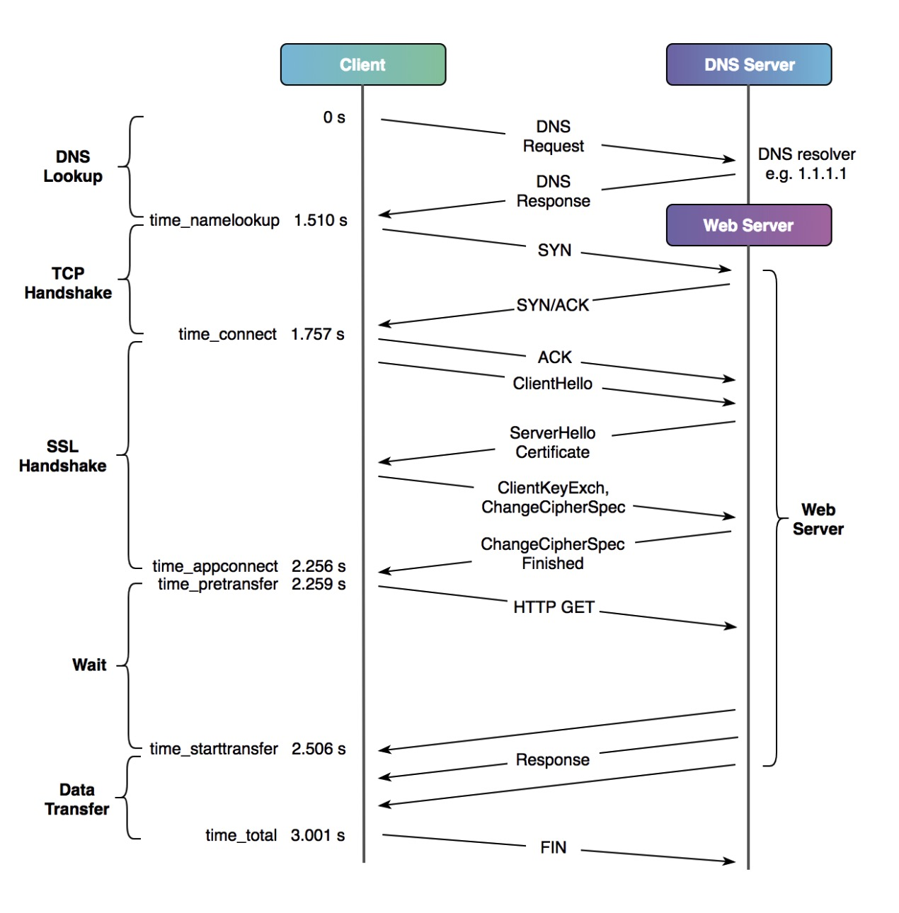
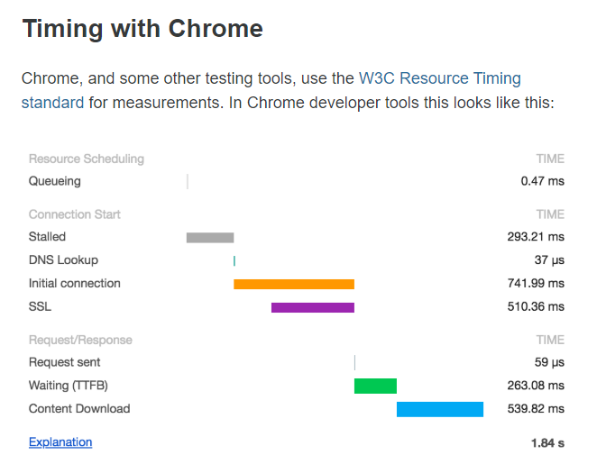

# HTTP请求子过程日志

包括URL、双端IP、各子过程请求时间、报错信息等

目录如下

* [一次完整HTTP请求](#一次完整HTTP请求)
* [基于CURL-C](#基于CURL-C)
* [基于HTTPSTAT-GOLANG](#基于HTTPSTAT-GOLANG)
* [基于OKHTTP-JAVA](#基于OKHTTP-JAVA)
* [基于Google-Chrome](#基于Google-Chrome)
* [Reference](#Reference)

# 一次完整HTTP请求

一次完整的HTTP请求，包括 dns请求、tcp连接、ssl握手、首包等待、剩余包传输



# 基于CURL-C

```
curl -v -so /dev/null https://www.qiniu.com/ -w "dnslookup: %{time_namelookup} | connect: %{time_connect} | appconnect: %{time_appconnect} | pretransfer: %{time_pretransfer} | starttransfer: %{time_starttransfer} | total: %{time_total} | size: %{size_download}\n"

(部分输出)
* Connected to www.qiniu.com (58.222.55.69) port 443 (#0)
* Server certificate:
*        subject: C=CN; L=Shanghai; O=Shanghai Qiniu Information Technologies Co., Ltd.; OU=IT Dept.; CN=*.qiniu.com
*        start date: 2018-02-02 00:00:00 GMT
*        expire date: 2020-07-20 12:00:00 GMT
*        subjectAltName: www.qiniu.com matched
*        issuer: C=US; O=DigiCert Inc; OU=www.digicert.com; CN=GeoTrust RSA CA 2018
*        SSL certificate verify ok.
> GET / HTTP/1.1
> User-Agent: curl/7.35.0
> Host: www.qiniu.com
> Accept: */*

< HTTP/1.1 200 OK
< Content-Type: text/html; charset=utf-8
< Transfer-Encoding: chunked
< Connection: keep-alive
* Server nginx is not blacklisted
< Server: nginx
< X-Frame-Options: Allow-From https://hm.baidu.com
< X-XSS-Protection: 1; mode=block
< X-Content-Type-Options: nosniff
< ETag: W/"a81e576c0ad437b6b211b073bc7aa651"
< Cache-Control: max-age=0, private, must-revalidate

（关键部分）
dnslookup: 0.028 | connect: 0.035 | appconnect: 0.054 | pretransfer: 0.054 | starttransfer: 0.210 | total: 0.231 | size: 70348
```

# 基于HTTPSTAT-GOLANG

详见 Reference 关于 HTTPSTAT

一次完整的HTTP请求，包括 DNS Lookup、TCP Connection、TLS Handshake、Server Processing、Content Transfer


# 基于OKHTTP-JAVA

代码DEMO：[OKHTTP3_LOG.java](src/main/OKHTTP3_LOG.java)

### 日志例子

请求URL https://www.qiniu.com/?a=1&b=2

得到日志如下

```
call start.
method: GET
url: https://www.qiniu.com/?a=1&b=2
schema: https
host: www.qiniu.com
encoded path: /
encoded query: a=1&b=2
dns start.
domain: www.qiniu.com
dns end, cost 0.018s.
connect start.
server ip: 61.147.234.139
secure connect start.
secure connect end, cost 0.167s.
connect end, cost 0.193s.
connect acquired.
request headers start.
request headers end.
request headers end, cost 0.001s.
request headers: [Host: www.qiniu.com, Connection: Keep-Alive, Accept-Encoding: gzip, User-Agent: okhttp/3.14.2, ]
response headers start.
response headers end, cost 0.281s.
status code: 200
response headers: [Date: Tue, 26 Nov 2019 20:48:57 GMT, Content-Type: text/html; charset=utf-8, Transfer-Encoding: chunked, Connection: keep-alive, Server: nginx, X-Frame-Options: Allow-From https://hm.baidu.com, X-XSS-Protection: 1; mode=block, X-Content-Type-Options: nosniff, ETag: W/"8c60a2ba20578d2f2ec53587974d3da5", Cache-Control: max-age=0, private, must-revalidate, Set-Cookie: _official_session=M1djMVhOcFgweWlmRnl6MWRlT3MwM2lJVXUrZTdvTUdtZ2Q1MU5ZaGNPNTFhRmFWd1R3Mk9HL1ZmeFRIdGNTMWhGbE5DdXcrVkxOVE44eTNZZFNpSlVWMXhsVy9iMzI3dGNMNkswUEx4R2djYVFCYjBWWkg5WXUyT1BPd0pYOXBsWjhzcDdqKzRZRXBRMjY0S0h6ZmR3PT0tLVM4WUVuODFucXFaeHQ2Z2h1WGdCY2c9PQ%3D%3D--15dab9bb2f600b7b2256f8abbed26db86259bd10; path=/; HttpOnly, X-Request-Id: 2e61a183-6842-4b06-bd36-3cf9baf3034c, X-Runtime: 0.033959, X-Ser: BC80_dx-lt-yd-jiangsu-taizhou-4-cache-4, BC139_dx-jiangsu-nantong-4-cache-5, X-Cache: MISS from BC139_dx-jiangsu-nantong-4-cache-5(baishan), ]
response body start.
response body end, cost 0.039s, count 0 bytes.
connect released.
call end, cost 0.567s.
```

### 代码解读

通过衍生类 HttpEventListener（继承 EventListener），记录各个请求阶段的时间及日志

一次完整的HTTP请求，包括 dns、conncet（ssl）、request header、request body、response header、response body 几个过程

```Java
class HttpEventListener extends EventListener {

    private long callStartNanos;
    private long dnsStartNanos;
    private long connectStartNanos;
    private long secureConnectStartNanos;
    private long requestHeadersStartNanos;
    private long requestBodyStartNanos;
    private long responseHeadersStartNanos;
    private long responseBodyStartNanos;
    
    @Override
    public void dnsStart(Call call, String domainName) {
        super.dnsStart(call, domainName);
        System.out.println("dns start.");
        System.out.println("domain: " + domainName);
        dnsStartNanos = System.nanoTime();
    }

    @Override
    public void dnsEnd(Call call, String domainName, List<InetAddress> inetAddressList) {
        super.dnsEnd(call, domainName, inetAddressList);
        long nanoTime = System.nanoTime();
        System.out.printf("dns end, cost %.3fs.\n", (nanoTime - dnsStartNanos) / 1000000000d);
    }
    
    @Override
    public void connectStart(Call call, InetSocketAddress inetSocketAddress, Proxy proxy) {
    	super.connectStart(call, inetSocketAddress, proxy);
    	System.out.println("connect start.");
    	System.out.println("server ip: " + inetSocketAddress.getAddress().getHostAddress());
    	connectStartNanos = System.nanoTime();
    }
    
    @Override
    public void connectEnd(Call call, InetSocketAddress inetSocketAddress, Proxy proxy, Protocol protocol) {
        super.connectEnd(call, inetSocketAddress, proxy, protocol);
        long nanoTime = System.nanoTime();
        System.out.printf("connect end, cost %.3fs.\n", (nanoTime - connectStartNanos) / 1000000000d);
    }
    
    @Override
    public void connectFailed(Call call, InetSocketAddress inetSocketAddress, Proxy proxy, Protocol protocol, IOException ioe) {
        super.connectFailed(call, inetSocketAddress, proxy, protocol, ioe);
        long nanoTime = System.nanoTime();
        System.out.printf("connect failed for %s, cost %.3fs\n.", ioe.getMessage(), (nanoTime - connectStartNanos) / 1000000000d);
    }
}
```

# 基于Google-Chrome

打开开发者模式（F12），找到 Network - Name - Timing，查看瀑布图


一次完整的HTTP请求，包括 Queueing、Stalled、DNS Lookup、Initial Connection、SSL、Request sent、Waiting(TTFB)、Content Downloading 几个部分



# Reference

- [A Question of Timing](https://blog.cloudflare.com/a-question-of-timing/)
- [OkHttp之网络请求耗时统计](https://blog.csdn.net/joye123/article/details/82115562)
- [移动互联网时代，如何优化你的网络](https://yq.aliyun.com/articles/58967?spm=a2c4g.11186623.2.11.66f5702d0tveyr)
- [github square/okhttp](https://github.com/square/okhttp/)
- [github curl/curl](https://github.com/curl/curl/)
- [github davecheney/httpstat](https://github.com/davecheney/httpstat/)
